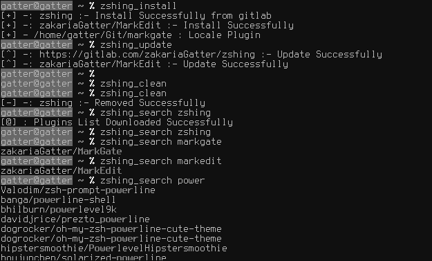

# zshing

## Table of Contents

- [About](#about)
- [Quick Start](#quick-start)
- [Using Zshing](#using-zshing)
- [TODO](#todo)

## About

[Zshing] Zsh plugin manager similar to VundleVim

[Zshing] allows you to...

* keep track of and configure your plugins right in the `.zshrc`
* Install Zsh plugins from Github or Localy
* Install zsh Plugind from Gitlab and BitBucket
* Update Zsh plugins
* Search by name all available Zsh Plugins
* Clean unused plugins up
* run the above actions in a *single command*

[Zshing] automatically...

* manages the __Source Plugins__ of your installed Plugins

[Zshing] is undergoing an interface change, please stay up to date to get latest changes.



## Quick Start

1. Introduction:

   Installation requires : 
    * __Git__ triggers `git clone` for each configured repository to `~/zshing` by default.
    * __Curl__ is required for search.

2. Set up [Zshing]:

   ` git clone https://gitlab.com/zakariaGatter/zshing.git ~/.zshing/zshing`

3. Configure Plugins:

   Put this at the top of your `.zshrc` to use Zshing. Remove plugins you don't need, they are for illustration purposes.

   ```zsh
    # Set Plugin configuration Before ZSHING_PLUGINS
    
    ZSHING_PLUGINS=(
        "https://gitlab.com/zakariaGatter/zshing" # Downlad from gitlab Leave it for future updates 
        "zakariaGatter/MarkEdit" # github on default 
        "$HOME/Git/MarkGate" # a local Plugin
    )

    # source zshing plugin 
    source $HOME/.zshing/zshing/zshing.zsh
   ```

4. Note :

    if you find this message and you sure that the plugin is work properly 
    
    > [X] -: "REPONAME" :- Zshing can't source This Plugin there is no [zsh/sh] extension
    
    just add `.zsh/.sh` to the source file

## Using Zshing

```
    ZSHING ( 0.3 )
    Write by Zakaria Gatter (zakaria.gatter@gmail.com)

    Zsh Plugin to manage Plugin similar to VundleVim

    OPTS : 
        zshing_install  [Install Plugin direct from Local or Online git Repos]
        zshing_update   [Update existing Plugins in your system]
        zshing_clean    [Clean and Remove unwanted Plugins]
        zshing_search   [Search for Plugins Themes and Completions]
        zshing_help     [Show this help Dialog]
```

## TODO
[Zshing] is a work in progress, so any ideas and patches are appreciated.

* [X] Install Plugins from Github
* [X] Install Plugins Localy
* [X] Search for Plugins
* [X] Update Plugins 
* [X] Clean Unwanted Plugins
* [X] Update Plugins List every time you run `zshing_search`
* [X] Install Plugins From gitlab and others


[Zshing]:http://gitlab.com/zakariagatter/zshing
